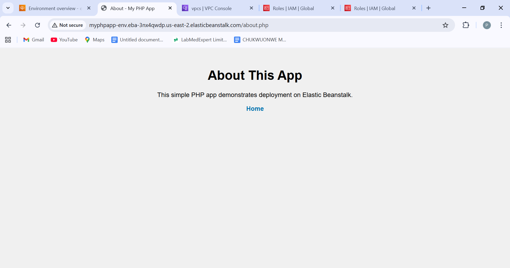

# PHP Elastic Beanstalk App

A simple PHP web application deployed on **AWS Elastic Beanstalk**, demonstrating deployment of a LAMP-style app on a PaaS platform. Includes lessons learned from a **403 Forbidden Nginx error**.

## Features
- Home page (`index.php`) and About page (`about.php`)
- Basic CSS styling (`styles.css`)
- Multi-page PHP web app deployed on AWS Elastic Beanstalk
- Hands-on experience with EB environment, monitoring, and version management

## Screenshots
1. EB Dashboard  
   
2. Environment Creation  
     
3. Upload & Deploy  
     
4. 403 Nginx Error  
     
5. Home Page Live  
     
6. About Page Live  
     
7. Termination of eb  
     

## Lessons Learned
- **File structure matters**: placing PHP files at the root of the zip avoids 403 Forbidden errors  
- Cloud deployment isn’t just about code — configuration, environment setup, and platform understanding are equally critical  
- Elastic Beanstalk simplifies deployment, monitoring, and version control for PHP apps  

## Deployment Instructions
1. Zip all files at the root of the folder (index.php, about.php, styles.css)  
2. Deploy the zip to AWS Elastic Beanstalk (PHP platform)  
3. Verify the live application via the EB environment URL  

## Cleanup
Since this is a learning project, **delete all Elastic Beanstalk environments and associated EC2 instances** after testing to avoid unnecessary AWS costs.
